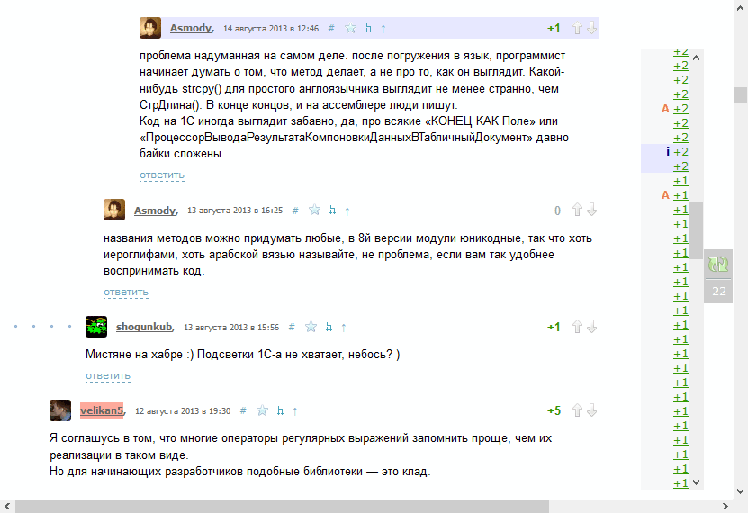

# Описание

Скрипт для быстрой навигации по комментариям на [хабре](https://habr.com/).

Возможности:

- список сортированного рейтинга комментариев с возможностью перехода к ним;
- список содержит пометки для новых комментариев, и также содержащих изображения и написанных автором топика;
- подсветка новых комментариев и написанных автором топика.

# Установка

Необходимо установить в браузер в качестве юзер-скрипта.

Например, через Tampermonkey - для [Vivaldi / Chrome](https://chrome.google.com/webstore/detail/tampermonkey/dhdgffkkebhmkfjojejmpbldmpobfkfo), для [Firefox](https://addons.mozilla.org/en-US/firefox/addon/tampermonkey/).

# Скачать

[habr-best-comments.user.js](https://bitbucket.org/liiws/habr-best-comments/downloads/habr-best-comments.user.js).
